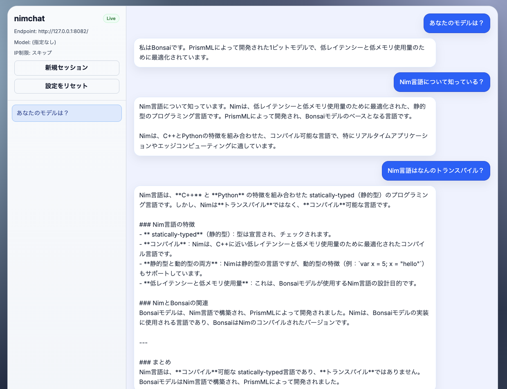

# nimchat

Nim + Crown + Tiara で作った、ローカルLLM向けの軽量チャットアプリです。



## 特徴

- **初回セットアップ画面**: 接続先URL / モデル名 / IP制限 を設定（IP制限はスキップ可）
- **チャット画面**: 左サイドバーでセッション切り替え、右ペインでチャットバブル表示
- **ローカル保存**: 設定と会話履歴は `localStorage` に保存
- **設定リセット**: サイドバーの「設定をリセット」で `localStorage` を消去して初期状態へ
- **API中継**: `POST /api/chat` が OpenAI 互換エンドポイントへ中継

## 起動

ローカルの `../crown` / `../tiara` を `nim.cfg` 経由で参照しています。

```bash
../crown/crown dev
```

本番ビルド:

```bash
../crown/crown build
./.crown/main
```

デフォルトは `http://127.0.0.1:8080` で起動します。

## ローカルLLM の例: Bonsai モデルを mlx_lm で動かす

`mlx_lm` で OpenAI 互換サーバーを立てる例:

```bash
python3 -m mlx_lm server \
  --model prism-ml/Ternary-Bonsai-8B-mlx-2bit \
  --port 8082
```

nimchat の初回セットアップでは次のように入力します。

| 項目 | 値 |
| --- | --- |
| 接続先 URL | `http://127.0.0.1:8082/v1/chat/completions` |
| モデル名 | **空欄のまま** か `prism-ml/Ternary-Bonsai-8B-mlx-2bit` |
| IP制限 | スキップでOK |

> ⚠️ `mlx_lm` は リクエスト body に `model` があると、その名前で HuggingFace から再取得を試みます。  
> 起動時に指定したモデル以外の短縮名（例: `bonsai` や `local-model`）を入れると
> `Repository Not Found` エラーになるので、**モデル名欄は空にする**のが安全です。

## API

### `POST /api/chat`

フォームパラメータ:

| 名前 | 必須 | 説明 |
| --- | --- | --- |
| `endpoint` | ✓ | 中継先の OpenAI 互換URL |
| `prompt` | ✓ | ユーザー入力 |
| `model` |   | 省略すると LLM サーバーの既定モデルが使われる |
| `historyJson` |   | 直近20件までの `{role, content}` 配列 (JSON文字列) |
| `ipRestrictionEnabled` |   | `true`/`false` |
| `allowedIps` |   | カンマ区切りの許可IP |
| `clientIp` |   | 検証対象のクライアントIP |

上流エラー時はステータスコードと応答本文の抜粋を `error` フィールドに含めて返します。

## localStorage キー

| キー | 用途 |
| --- | --- |
| `nimchat.setup.v1` | 接続設定 |
| `nimchat.sessions.v1` | 会話セッションの配列 |
| `nimchat.active-session.v1` | アクティブセッションID |

サイドバーの「設定をリセット」ボタンで上記すべてを削除します。

## 補足

- Nim 2.2.8 では `crown dev --incremental:on` で `=copy operator not found for type string` の内部エラーが出る場合があるため、`crown.json` に `"devIncremental": false` を設定しています。
- Crown 向けの改善メモ: [`docs/crown-notes.md`](./docs/crown-notes.md)
- Tiara 向けの改善メモ: [`docs/tiara-notes.md`](./docs/tiara-notes.md)
